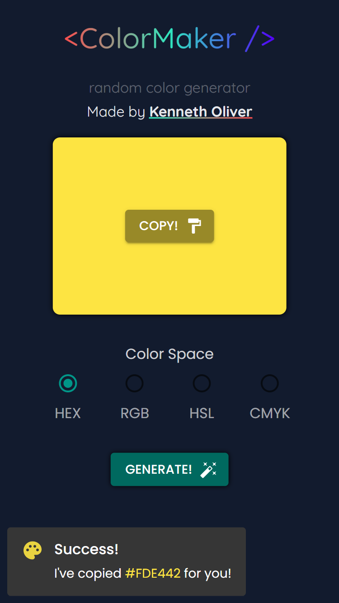

# ColorMaker

Try it out: [colormaker.vercel.app](https://colormaker.vercel.app)

## Technologies I used...
* React
* React Hooks
* Material UI

## Hardest Part
This was my 1st project using Material UI.

There was a bit of a learning curve, and I did refer to the documentation many times — which led to longer development time (2hrs total).

## Inspiration

I had previously built a random color generator, specifically for named CSS colors. I thought I had registered it with Vercel as ([random-color-gen.vercel.app](https://random-color-gen.vercel.app)), but it turns out I didn't. This was my repo [github.com/learning-reactjs/random-color-gen](https://github.com/learning-reactjs/random-color-gen).

I had a look at the website, and it inspired me to make this React app. Fear not, I made all of the code myself!

Also, mine differs since I used Material UI. 

---
Kenneth Oliver ©2022
